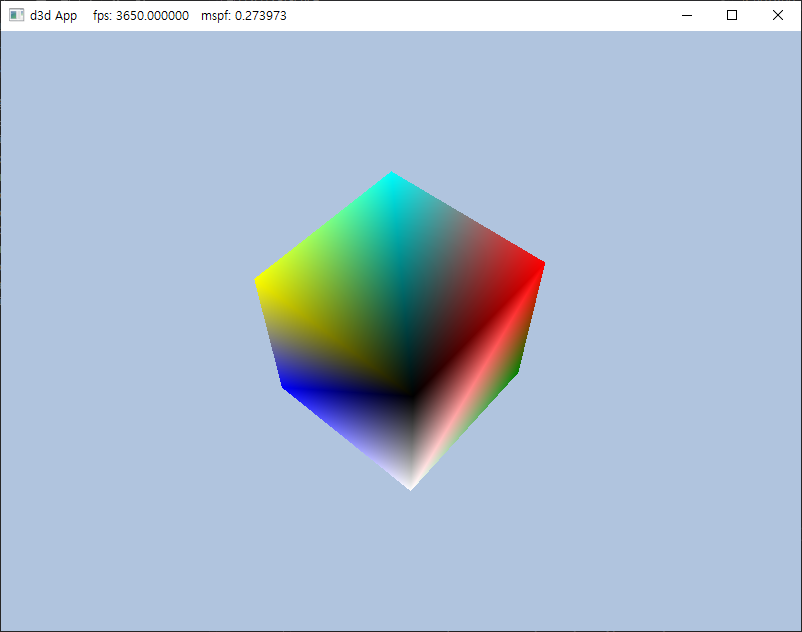

## D3D12Practice
DirectX 12를 이용한 3D 게임 프로그래밍 입문의 예제들을 연습하는 공간입니다.

--------------------------------------------------------------------------------
## 2021년 6월 23일 1일차 

DirectX 12 라이브러리를 적용하여 Part6 Box의 예제를 출력하였다. 

책이 오래전에 출간되어서 몇몇 부분에서 오류가 나타났다. 

<span style="color:red">(**특히 L-value!**)</span> 이를 해결하고 정상적으로 출력하였다. 

**변경내용** 
1.Chapter6 Drawing in Direct3D 의 Box 프로젝트의 BoxApp.cpp를 현재 프로젝트에 추가하였음. 
2.Common 폴더의 내용을 현재 프로젝트에 추가하였음. (**추후 Common폴더의 .cpp, .h 파일의 내용은 직접 작성하기로 함**) 
3.BoxApp.cpp의 현재 프로젝트에 포함된 Common폴더경로에 맞게 #include 헤더경로를 수정함
4.BoxApp.cpp에서 발생하는 L-value 오류를 임시방편으로 변수를 만들어 오류를 해결 
```c++ 
 auto resourceBarrier1 = CD3DX12_RESOURCE_BARRIER::Transition(CurrentBackBuffer(), 
        D3D12_RESOURCE_STATE_PRESENT, D3D12_RESOURCE_STATE_RENDER_TARGET); 
	mCommandList->ResourceBarrier(1, &resourceBarrier1); 
  
  auto currentBackBufferView = CurrentBackBufferView(); 
    auto depthStencilView = DepthStencilView(); 
	mCommandList->OMSetRenderTargets(1, &currentBackBufferView, true, &depthStencilView); 
  
   auto vertexBufferView = mBoxGeo->VertexBufferView(); 
    auto indexBufferView = mBoxGeo->IndexBufferView(); 
	mCommandList->IASetVertexBuffers(0, 1, &vertexBufferView); 
	mCommandList->IASetIndexBuffer(&indexBufferView); 

   auto resourceBarrier2 = CD3DX12_RESOURCE_BARRIER::Transition(CurrentBackBuffer(), 
        D3D12_RESOURCE_STATE_RENDER_TARGET, D3D12_RESOURCE_STATE_PRESENT); 
	mCommandList->ResourceBarrier(1, &resourceBarrier2); 
  
```

**출력이미지** 
 

