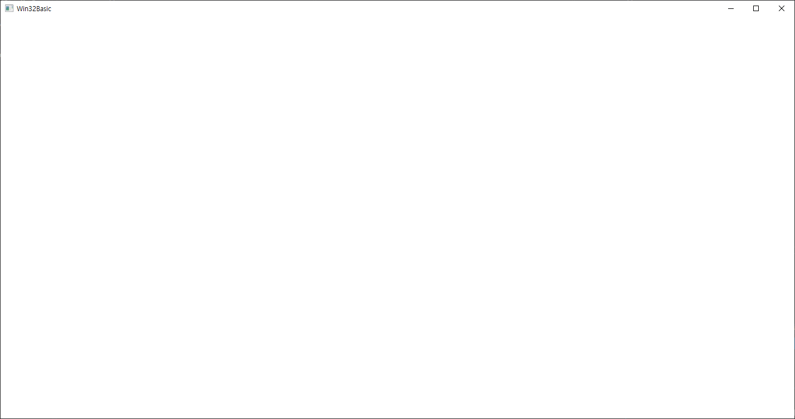

## D3D12Practice :rocket: :metal: 
DirectX 12를 이용한 3D 게임 프로그래밍 입문의 예제들을 연습하는 공간입니다.

--------------------------------------------------------------------------------
## 2021년 6월 23일 (1일차)

### : DirectX 12 라이브러리 적용하기


> DirectX 12 라이브러리를 적용하여 Part6 Box의 예제를 출력하였다. 
> 
> 책이 오래전에 출간되어서 몇몇 부분에서 오류가 나타났다. (**특히 L-value!**) 
> 
> 이를 해결하고 정상 출력하였다. 


 **변경내용** 

1.Chapter6 Drawing in Direct3D 의 Box 프로젝트의 BoxApp.cpp를 현재 프로젝트에 추가하였음. 

2.Common 폴더의 내용을 현재 프로젝트에 추가하였음. 

(**추후 Common폴더의 .cpp, .h 파일의 내용은 직접 작성하기로 함**) 

3.BoxApp.cpp의 현재 프로젝트에 포함된 Common폴더경로에 맞게 #include 헤더경로를 수정함 

4.BoxApp.cpp에서 발생하는 L-value 오류를 임시방편으로 변수를 만들어 오류를 해결 

```c++ 
 auto resourceBarrier1 = CD3DX12_RESOURCE_BARRIER::Transition(CurrentBackBuffer(), 
        D3D12_RESOURCE_STATE_PRESENT, D3D12_RESOURCE_STATE_RENDER_TARGET); 
	mCommandList->ResourceBarrier(1, &resourceBarrier1); 
  
  auto currentBackBufferView = CurrentBackBufferView(); 
    auto depthStencilView = DepthStencilView(); 
	mCommandList->OMSetRenderTargets(1, &currentBackBufferView, true, &depthStencilView); 
  
   auto vertexBufferView = mBoxGeo->VertexBufferView(); 
    auto indexBufferView = mBoxGeo->IndexBufferView(); 
	mCommandList->IASetVertexBuffers(0, 1, &vertexBufferView); 
	mCommandList->IASetIndexBuffer(&indexBufferView); 

   auto resourceBarrier2 = CD3DX12_RESOURCE_BARRIER::Transition(CurrentBackBuffer(), 
        D3D12_RESOURCE_STATE_RENDER_TARGET, D3D12_RESOURCE_STATE_PRESENT); 
	mCommandList->ResourceBarrier(1, &resourceBarrier2); 
  
```

  **출력이미지** 

 

--------------------------------------------------------------------------------
## 2021년 6월 24일 (2일차)

### : Window 창 생성 예제 수행

> 부록A의 윈도우 창을 생성해 보았다.
>
> 예전에 작성해 보았던 내용들이 새록새록 떠오르는 느낌을 받았다.
> 
> 책의 주석을 작성하여 평생 잊지 않도록 만들었다.

 **핵심 기능**
1. 창 초기화
 * WNDCLASS 작성 (WndProc 연동)
 * WNDCLASS 등록
2. 창 생성
3. 창 표기, 갱신
4. 연동한 WndProc 작성


  **출력이미지** 

 

--------------------------------------------------------------------------------
## 2021년 6월 25일 (3일차)

### :DirectX12 초기화 (1) Window 생성 클래스화

> DirectX12 장치를 적용시키기 전 사전 작업으로 Window 생성 관련해서 클래스화 하는
> 
> 작업을 거쳤다. 코드를 작성하면서 처음 보는 코드가 있어 간단한 설명만 하고 남은 부분은
> 
> 변경 사항을 통해 확인할 수 있다.

 **변경내용** 

1. D3DApp 클래스 작성 (Window 생성관련해서만 작성되었음)
2. Debug모드시 메모리 누수를 추적가능하게 적용

이중에서 2에 대해 간략하게 작성하기로 함

추가 내용은 다음의 경로에서 확인할 수 있음

[DirectX12 초기화(1)](https://iorez.github.io/Categori/DirectX12/DirectX12Beginner/DirectX12%20Init(1).html)

 **핵심 코드**

```c++
#if defined(DEBUG) || defined(_DEBUG)
#define _CRTDBG_MAP_ALLOC	// 메모리 누수 탐지 기능을 사용하기 위해 선언한다.
#include <crtdbg.h>			// 메모리 할당을 추적한다. _CrtDumpMemoryLeaks(), _CrtSetDbgFlag()
#endif

#if defined(DEBUG) | defined(_DEBUG)
	_CrtSetDbgFlag(_CRTDBG_ALLOC_MEM_DF | _CRTDBG_LEAK_CHECK_DF);
#endif

```

<crtdbg.h>의 헤더를 사용하기 위해서 **_CRTDBG_MAP_ALLOC** 을 선언한다.

<crtdbg.h>을 선언하는 이유는 메모리 할당한 것을 디버그에서 추적이 가능하게 만드는 함수들이

헤더파일에 정의 되어 있기 때문이다. 그중 **_CrtSetDbgFlag**라는 함수가 있다.

위와 같이 binary방식의 매개변수를 전달하여 이 함수를 사용할 수 있다.

이 함수는 호출 이후 메모리 누수를 감지를 시작한다. 

**_CRTDBG_ALLOC_MEM_DF** 플래그 값이 디버그모드에서 메모리 할당이 일어날 때 마다 추적한다.

**_CRTDBG_LEAK_CHECK_DF** 플래그 값이 프로그램이 종료되기 전에 

자동으로 **_CrtDumpMemoryLeaks()** 함수를 호출하여 메모리를 할당한 후 해제 하지 않는 메모리가 있는지 확인한다.

--------------------------------------------------------------------------------
## 2021년 6월 26일 (4일차)
### :DirectX12 초기화(2) Device, Fence 생성, 서술자 크기, 4X MSAA Quality 획득

> DirectX12 초기화 과정으로 Device와 Fence를 생성한다. 
> 
> 이후 GPU마다 다른 서술자의 크기를 미리 알아내고 4X MSAA에서 지원 가능한 Quality를 점검한다.
> 
> Device로 부터 적절한 하드웨어 어뎁터를 얻을 수 없다면 소프트웨어 어뎁터 **WARP** 를 지원하게 한다. 

 **변경내용**

1. Factory 생성
2. Fence, 서술자 크기 확인 코드 작성
3. 4X MSAA 지원 점검 코드 작성

추가 내용은 다음의 경로에서 확인할 수 있음

[DirectX12 초기화(2)](https://iorez.github.io/Categori/DirectX12/DirectX12Beginner/DirectX12%20Init(2).html) 
